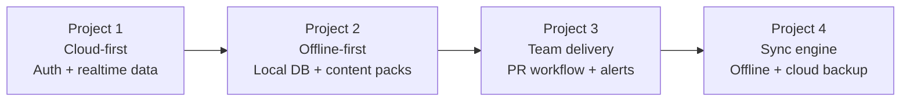
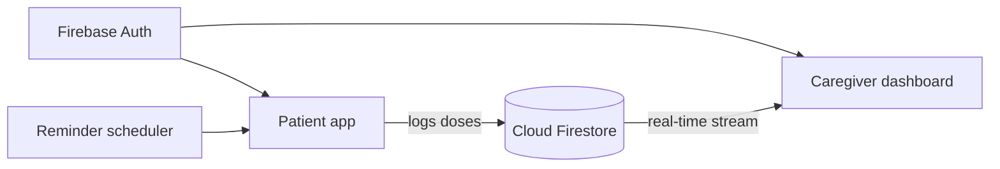
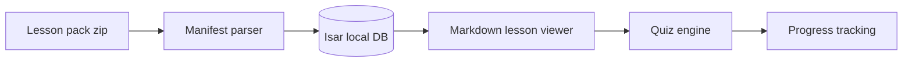
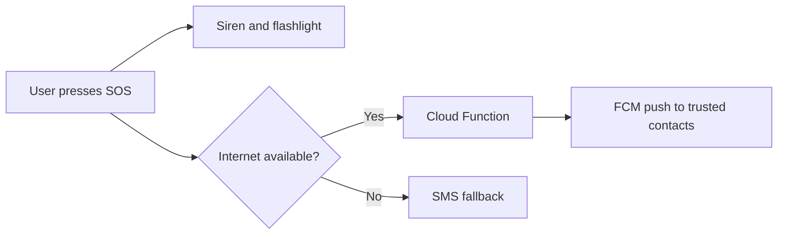
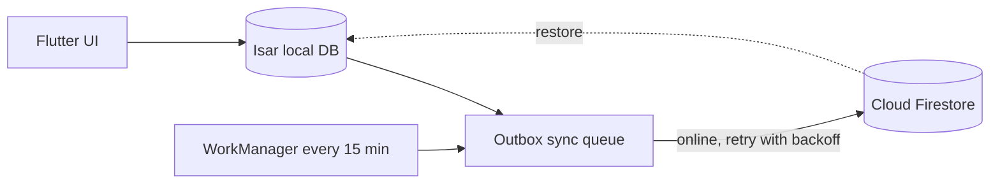
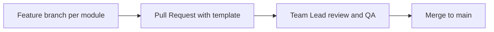

<div align="center">


**Four production-style Flutter apps built by Team M2 during the Zeppelin Labs Flutter Fellowship.**
Healthcare, education, personal safety and small business finance, all in one repository.

</div>

---

## Table of Contents

| | Section |
|---|---|
| :bar_chart: | [Projects Overview](#projects-overview) |
| :milky_way: | [Fellowship Journey](#fellowship-journey) |
| :pill: | [Project 1: Medication and Habit Reminder](#project-1-medication-and-habit-reminder) |
| :school: | [Project 2: Offline-First Rural Education](#project-2-offline-first-rural-education) |
| :woman: | [Project 3: SafeWalk](#project-3-safewalk) |
| :books: | [Project 4: KhataBook Lite](#project-4-khatabook-lite) |
| :hammer_and_wrench: | [Tech Stack](#tech-stack) |
| :file_folder: | [Repository Structure](#repository-structure) |
| :rocket: | [Getting Started](#getting-started) |
| :twisted_rightwards_arrows: | [Development Workflow](#development-workflow) |
| :lock: | [Security](#security) |
| :busts_in_silhouette: | [Team](#team) |
| :e-mail: | [Contact](#contact) |

---

## Projects Overview

| # | Project | Problem Solved | Key Technologies | Status |
|:-:|---------|----------------|------------------|:------:|
| 1 | **Medication and Habit Reminder** | Missed medicines and no visibility for caregivers | Firebase Auth, Firestore, local reminders | :white_check_mark: Completed (85/100) |
| 2 | **Offline-First Rural Education** | Students with little or no internet access | Isar, Markdown, zip lesson packs | :white_check_mark: Completed |
| 3 | **SafeWalk** | Personal safety while walking alone | Firebase, FCM, Cloud Functions, Supabase | :white_check_mark: Completed |
| 4 | **KhataBook Lite** | Paper ledgers for street vendors and shopkeepers | Isar, Firestore, WorkManager, OTP auth | :white_check_mark: Completed |

## Fellowship Journey

Each project built on the skills of the previous one, from cloud-first apps to offline-first systems and team-based delivery.



---

## Project 1: Medication and Habit Reminder

A Flutter + Firebase app that helps users follow medication schedules and daily habits, with a real-time dashboard that lets caregivers monitor adherence remotely.

**Features**

| Feature | Description |
|---------|-------------|
| :lock: Authentication | Firebase email sign up and login |
| :alarm_clock: Smart reminders | Scheduling service for medicines and habits |
| :family: Caregiver dashboard | Real-time updates powered by Cloud Firestore |
| :chart_with_upwards_trend: Adherence tracking | History of taken and missed doses |

**How it works**



---

## Project 2: Offline-First Rural Education

A Flutter + Isar app that delivers lessons and quizzes to students in low or no connectivity areas. After the first download, everything works fully offline.

**Features**

| Feature | Description |
|---------|-------------|
| :no_mobile_phones: Offline-first | All content and progress stored locally with Isar |
| :package: Lesson packs | Zip + manifest based content delivery and parser |
| :book: Lesson viewer | Markdown rendered lessons |
| :pencil: Quiz engine | Quizzes linked to each lesson |
| :white_check_mark: Progress tracking | Lesson completion and student profile |

**Content pipeline**



**Run Project 2 directly**

```bash
flutter pub get
flutter run -t lib/view_lessons.dart
```

You can also launch Project 1 normally and tap the school icon after login.

---

## Project 3: SafeWalk

A women's safety companion app that keeps trusted contacts informed during a walk and raises instant alerts in an emergency.

**Features**

| Feature | Description |
|---------|-------------|
| :sos: SOS alerts | One tap siren, flashlight, SMS fallback and FCM push notifications |
| :walking_woman: Walk With Me | Live session shared with trusted contacts |
| :telephone_receiver: Fake Call | Simulated incoming call to leave uncomfortable situations |
| :stopwatch: Check-in timer | Automatic alert if the user does not check in |
| :world_map: Route deviation | Detects when the user leaves the planned route |
| :busts_in_silhouette: Trusted contacts | Secure login and contact management |

**SOS flow**



**Download:** [SafeWalk v1.0 APK](https://github.com/sardarfahadali18-wq/fellowship-project-1/releases/tag/v1.0-safewalk)

---

## Project 4: KhataBook Lite

An offline-first digital ledger (khata) for street vendors and shopkeepers in Pakistan. It works with no internet and syncs automatically when connectivity returns.

**Features**

| Feature | Description |
|---------|-------------|
| :iphone: Phone OTP signup | Pakistani number validation, 60 second resend, persistent session |
| :globe_with_meridians: Multi-language | Urdu, English, Punjabi and Sindhi with RTL support |
| :mortar_board: Onboarding | 3-screen tutorial designed for first-time vendors |
| :memo: Core ledger | Add customers, record transactions, live balance view |
| :arrows_counterclockwise: Sync engine | Outbox queue, exponential backoff retry, 15 minute background sync |
| :cloud: Cloud backup | Firestore backup and restore with owner-only rules |
| :bell: Reminders and sharing | WhatsApp and SMS reminders, shareable ledger, overdue filter |
| :bar_chart: Dashboard | Gave, Got and You will receive summary with recent activity |

**Offline-first sync architecture**



**Run the demo entry points**

```bash
flutter pub get
flutter run -t lib/main_khatabook_dashboard_demo.dart
flutter run -t lib/main_khatabook_auth_demo.dart
```

---

## Tech Stack

<div align="center">


</div>

| Layer | Technologies |
|-------|--------------|
| Framework | Flutter, Dart |
| Authentication | Firebase Auth (email and phone OTP) |
| Cloud | Cloud Firestore, Cloud Functions, Firebase Cloud Messaging, Supabase |
| Local storage | Isar |
| Background work | WorkManager |
| Content | Markdown rendering, zip lesson packs |
| Testing | Flutter unit and widget tests |
| Workflow | Git, GitHub Pull Requests, branch per module |

## Repository Structure

| Path | Purpose |
|------|---------|
| `lib/` | Application source code for all projects |
| `lib/screens/` | Screens for Projects 1 and 2 |
| `lib/khatabook/` | KhataBook Lite modules |
| `lib/main_khatabook_*_demo.dart` | Standalone entry points for KhataBook modules |
| `test/khatabook/` | KhataBook unit and widget tests |
| `android/` | Android platform configuration |
| `.github/` | Pull request template |

## Getting Started

**Requirements:** Flutter SDK, Android SDK or emulator, a Firebase project configured for the apps.

```bash
git clone https://github.com/sardarfahadali18-wq/fellowship-project-1.git
cd fellowship-project-1
flutter pub get
flutter run
```

Plain `flutter run` launches Project 1. Use the `-t` entry points shown in each project section for the others. An Android emulator or device is recommended, as web builds do not support Isar IDs.

## Development Workflow



- Every team member owned one module per project and worked on their own branch.
- All changes went through Pull Requests using a shared PR template.
- The Team Lead reviewed, tested on an emulator, and merged.
- The `main` branch is protected: direct pushes are blocked.

## Security

- Firestore rules are scoped so users can only read and write their own data.
- Hardcoded credentials were removed and secrets are kept out of source control.
- KhataBook cloud data is stored per vendor and protected by owner-only rules.

## Team

| Role | Member | SafeWalk Module | KhataBook Lite Module |
|------|--------|-----------------|-----------------------|
| :star: Team Lead | **Sardar Fahad Ali** | Fake Call, PR coordination | Home dashboard, PR review, final QA |
| Developer | Faizan | Auth and Trusted Contacts | Auth and Onboarding |
| Developer | Hamza | Walk With Me session | Offline Storage and Sync Engine |
| Developer | Hammas | SOS and Alerts | Core Ledger Loop |
| Developer | Adil | Check-in Timer and Route Deviation | Reminders and Sharing |

## Contact

**Sardar Fahad Ali** | Team Lead, Group M2

[](https://github.com/sardarfahadali18-wq)
[](https://www.linkedin.com/in/sardar-fahad-ali-25294032a)

<div align="center">


*Built with Flutter by Team M2 at Zeppelin Labs*

</div>